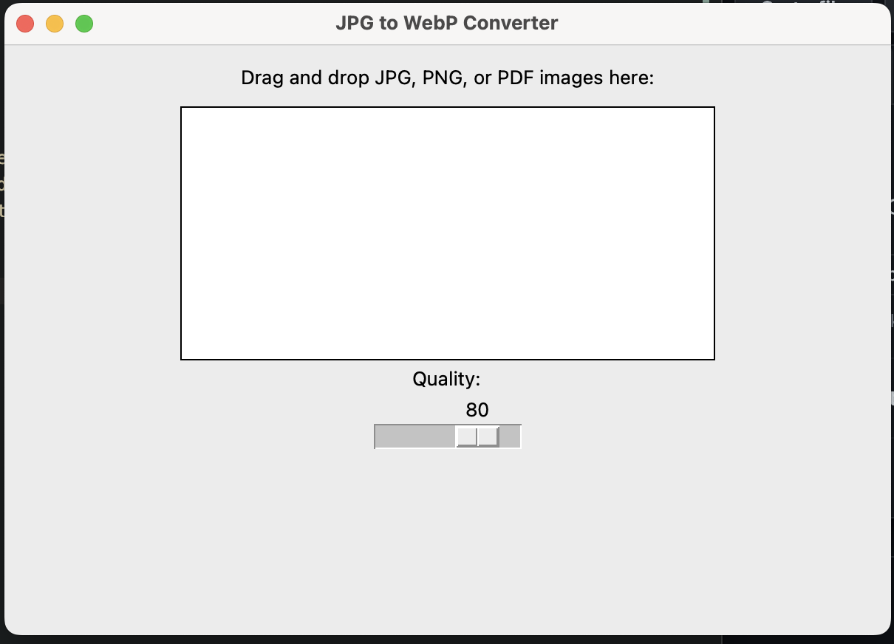
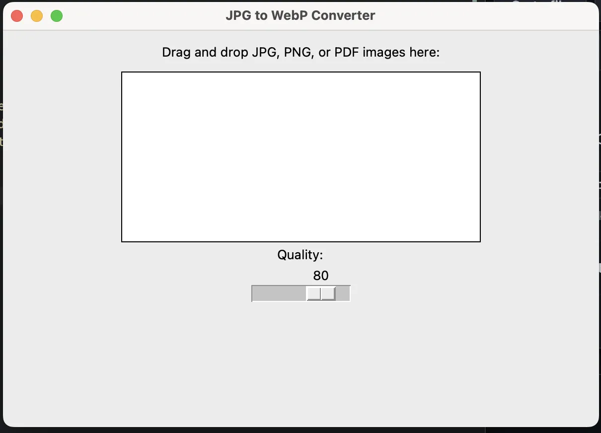

# Image -> WebP Converted

Simple TKInter Python app to convert jpg, png, and pdf files to WebP. 

## Problem

As a user I want smaller file sizes and modern file formats for web development 

Lightroom and others do not have a simple WebP export setting nor did I want to use website converters found online with the fear of images being stollen and needing internet. 

## Solution

This simple GUI is a drag and drop as many files as you want and converts them to WebP. I have it setup to drop on my desktop. It converts them nearly instantly. There is a slider to set your quality and it does a great job maintaining quality down to around 30%. 

## Demo

The first image is a PNG at 81KB and the second is a WebP image at 12KB

